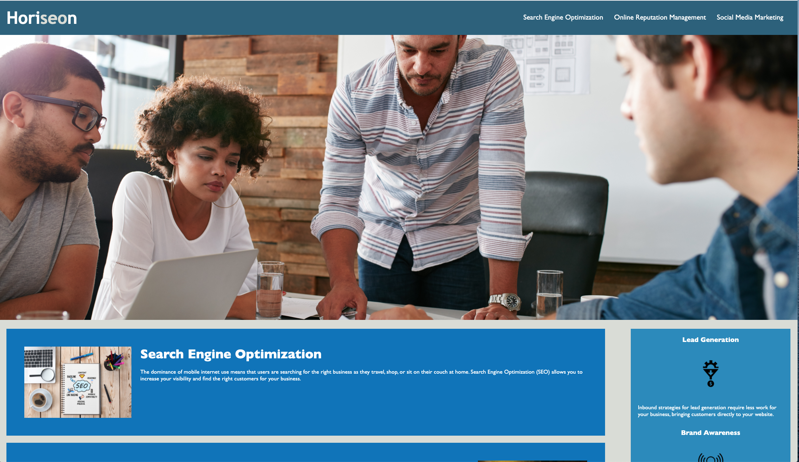

# week01-homework
This was our first homework assignment for the university of washington coding bootcamp class. it was a code refactor assignment which focused on refactoring code. There was a specific focus on refactoring the webpage to make it accessible to people with disabilities through the use of semantic tagmentation. 

Additionally an effort was made to confirm that all links were functioning correctly, that the CSS and the HTML was properly annotated and that the code was consolidated (specifically CSS selectors and properties). included below is a screenshot from the deployed website.

]
